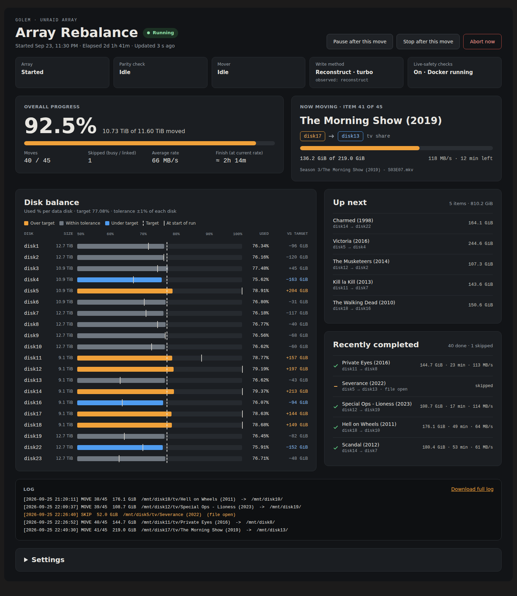

# Unraid-Rebalance

Rebalance your array after large data moves.

An Unraid plugin that rebalances array data so every data disk is filled to the same **percentage** of its capacity — a 14 TB disk ends up holding proportionally more than a 10 TB disk — with a live dashboard in the webGui.



## Install

**Community Applications:** search Apps for **Array Rebalance**.

**Manually:** Plugins → Install Plugin, paste:

```
https://raw.githubusercontent.com/FugginOld/Unraid-Rebalance/main/rebalance.plg
```

Then open **Settings → User Utilities → Array Rebalance**. Start with **Dry run**. The **Data Move** tab moves ticked disks, folders or files to the disks you tick, keeping their paths.

## How it works

1. **Target.** Target fill % = total used ÷ total capacity of the included data disks. Each disk's target is its size × that %. A disk is balanced within ± `TOLERANCE_PCT` of its own size.
2. **Plan.** Folders at `ITEM_DEPTH` inside each share (depth 1 = a movie folder or a whole TV series) are chosen largest-first from over-target disks and assigned to the most under-target disk that can take them without overshooting either side. Share included/excluded disks are honored, and nothing is planned onto a disk where the same path already exists.
3. **Execute.** Each item moves disk-to-disk with `rsync -aHAX --remove-source-files`, keeping its path, so user shares look identical. Every check is repeated right before each move.

**Dry run** only builds the plan. **Start rebalance** rebuilds the plan from current usage, then executes it.

## Safety

- Only `/mnt/diskN` → `/mnt/diskN`. Never `/mnt/user`, cache or pools.
- Source files are deleted only after they've been copied. The run stops on the first failed move.
- Parity is maintained on every write. Moves pause while a parity check/rebuild or the mover runs.
- Skips items that have open files, were written in the last `SKIP_RECENT_MIN` minutes, contain in-progress download patterns, or have hardlinks pointing outside the item (e.g. torrent ↔ media links). Skipped items are retried on the next run.
- Reconstruct write ("turbo") is pushed to the md driver for the run and the original setting restored afterwards. It is always applied, because `var.ini` can report `1` while the driver still does read/modify/write.

**Controls:** *Pause* and *Stop* take effect after the current move finishes. *Abort* stops immediately — the item in flight is left split across two disks (still readable through the user share).

## Shell

```
/usr/local/emhttp/plugins/rebalance/scripts/rebalance-ctl plan|run|pause|resume|stop|abort|status
tail -f /var/log/rebalance.log
```

## Layout

```
rebalance.plg                         plugin manifest (version + md5 patched by CI on release)
icon.png                              icon used by the Community Applications listing
build.sh                              builds releases/rebalance-<ver>-x86_64-1.txz (local test builds)
tests/engine_test.sh                  integration tests against a fake array (run by CI)
tests/syntax.sh                       bash / PHP / plg / JavaScript syntax checks (run by CI)
.github/workflows/test.yml            syntax checks + integration tests on push / PR
.github/workflows/release.yml         tag -> test -> build -> patch plg -> GitHub release
source/usr/local/emhttp/plugins/rebalance/
  Rebalance.page                      tabbed parent page (Settings -> User Utilities -> Array Rebalance)
  RebalanceMain.page                  tab 1: rebalance dashboard + settings
  DataMove.page                       tab 2: Data Move (ticked items -> ticked disks, same paths)
  default.cfg                         defaults; user settings in /boot/config/plugins/rebalance/rebalance.cfg
  scripts/rebalance.sh                engine: plan / run / move-plan / move-run
  scripts/rebalance-ctl               start / pause / resume / stop / abort
  include/common.css, common.js       styles and dashboard code shared by both tabs
  include/common.php                  helpers shared by the endpoints
  include/status.php                  JSON for the dashboard (GET)
  include/browse.php                  one folder of an array disk, for the Data Move tree (GET)
  include/action.php                  controls, Data Move selection, settings save (POST, CSRF-checked by the webGui)
  include/log.php                     log download
```

Runtime state: `/var/local/rebalance/` (status, plan.tsv, history.tsv, progress). Log: `/var/log/rebalance.log` (previous run in `.log.1`).

## Release

Packages are published as GitHub release assets by CI; nothing binary is committed.

1. Add a `###YYYY.MM.DD###` block to `<CHANGES>` in `rebalance.plg`, commit and push to `main`.
2. Tag main's tip with the same version and push the tag:
   ```
   git tag 2026.09.25 && git push --tags
   ```

`release.yml` then runs the tests, builds the `.txz`, patches `version` and `md5` into `rebalance.plg` (the download URL is derived from the version), commits that to `main`, and publishes the release with the package attached and your changelog block as the notes. It refuses a tag that isn't main's tip or has no matching changelog block. Same-day re-release: use a suffix such as `2026.09.25a` for both the block and the tag.

To test locally: `bash tests/engine_test.sh` and `bash build.sh`.

The Community Applications listing lives in [FugginOld/unraid-templates](https://github.com/FugginOld/unraid-templates) (`plugins/unraid-balance.xml`) and only points at `rebalance.plg` here. Version and changelog are read from the `.plg`, so releases don't touch the template repo.
